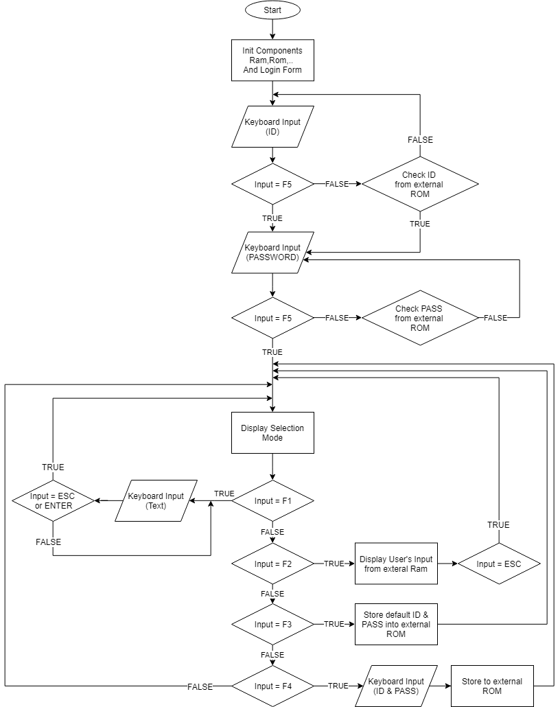

# Project-of-Embedded-System-Course

+ This project about store data from user input to Ram or Rom and then display on LCD
+ We build the system above with STM32F103C8T6 , our system have: 
- LCD
- Keyboard
- External Ram 
- External Rom 
- Extend devices ,...

# Video demo : https://youtu.be/Z6_3QKcfLMI
# Algorithm Diagram : 

# References
- RAM (24LC1024)  : Optimal code from this tutorial https://www.youtube.com/watch?v=eIP_w5uizNw&t=25s
- ROM (24C02)     : Optimal code from this tutorial https://github.com/yhyuan/STM32-Examples/tree/master/16-M3-IIC%20(EEPROM-24C02)/USER
- LCD-I2C         : Optimal code from this tutorial http://laptrinharmst.blogspot.com/2018/04/bai-12-i2c-voi-stm32f1.html
- Module Keyboard : https://github.com/phungorquan/Module-Keyboard-PS2-USB

# IDE: KEIL ARM
